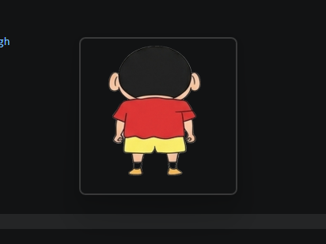

# Desktop Pet (PyQt6)

一个基于 PyQt6 的桌面宠物项目，支持动画播放、右键动作菜单、喂食与好感度成长、对话随机池等功能。

## 预览



## 功能亮点

- 透明无边框桌宠窗口，始终置顶显示。
- 点击/双击触发随机动作与气泡对话。
- 右键菜单动作：喂食、冲击球、功夫、打怪兽、战斗胜利、查看亲密度。
- 打怪兽动作结束后自动衔接胜利动画，胜利动画也可单独播放。
- 默认待机帧会在 3 张图片中随机选择。
- 好感度系统：
  - 点击与双击可提升好感度。
  - 喂食一次固定 +10 好感度。
  - 对话与好感度直接绑定，好感度提升后会进入更丰富的随机话术池。
- 随机动作池（点击触发）会随好感度等级扩展：
  - Lv.3 起可随机到 `impactball`
  - Lv.4 起可随机到 `kungfu`

## 项目结构

- `main.py`：程序入口。
- `pet_window.py`：桌宠主窗口、动画控制、交互逻辑。
- `intimacy.py`：好感度与等级规则。
- `dialog_bubble.py`：对话读取与随机抽取。
- `dialogs.json`：对话配置（含好感度随机池）。
- `state_machine.py`：点击动作状态选择。
- `tray_manager.py`：系统托盘菜单。
- `assets/`：各动作帧图资源。

## 安装与运行

1. 安装 Python 3.10+（推荐 3.11/3.12）。
2. 安装依赖：

```bash
pip install -r requirements.txt
```

3. 启动项目：

```bash
python main.py
```

### 最低启动方式（本地快捷部署）

- 直接双击 `start_quick.bat` 即可启动（脚本会优先使用 `py -3`，否则使用 `python`）。
- 命令行最小启动命令：

```bash
python main.py
```

### 快速退出方式

- 在桌宠本体上点击右键，选择“退出程序”。
- 或在系统托盘（任务栏右侧展开区）右键项目图标，选择“退出”。

## 资源说明

- 动画帧目录位于 `assets/` 下，按动作分文件夹组织。
- 支持常见命名方式（如 `0001.png`、`0002.png` ...）。
- 若某动作资源缺失，程序会自动回退到占位帧，避免崩溃。

## 数据保存

- 运行数据保存在 `save_data.json`，包括好感度、点击次数、最近登录日期等。

## 后续可扩展方向

- 增加动作冷却时间与权重控制。
- 对话按时间段（早/中/晚）分池。
- 添加更多战斗连招与音效。
- 增加设置面板（窗口大小、对话时长、帧率开关）。
